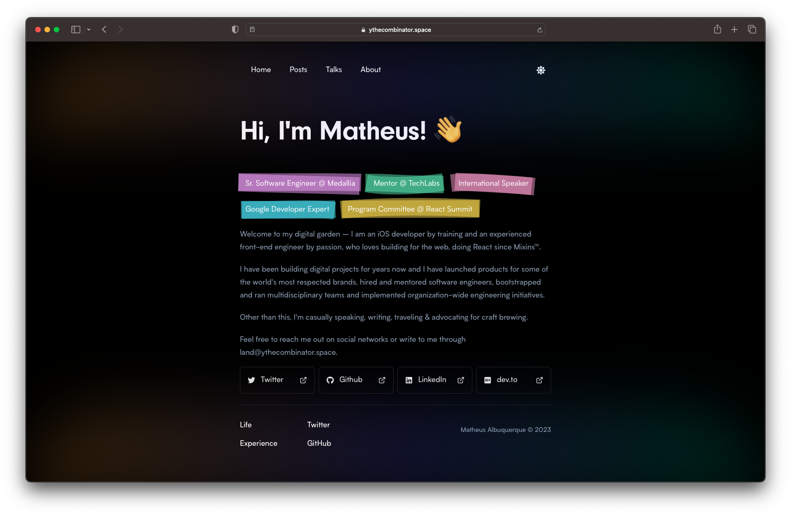

## Stack

- **🛠️ Framework**: [Next.js](https://nextjs.org)
- **👍 A11y:** [Radix UI Primitives](https://www.radix-ui.com/) + [axe](https://www.deque.com/axe/)
- **🌙 Dark Mode:** [next-themes](https://github.com/pacocoursey/next-themes)
- **🧑‍🎨 Animations:** [Framer](https://www.framer.com/docs/animation/)
- **🗄️ Deployment:** [Netlify](https://www.netlify.com/)
- **🔍 Searching:** [Orama](hhttps://github.com/oramasearch/orama)
- **🤖 AI Helpers:** [ChatGPT](https://chat.openai.com) + [Copilot](https://github.com/features/copilot)

### 📁 Data Sources

- Talks: [Contentful](https://www.contentful.com) + [Apollo](https://www.apollographql.com)
- CFPs: [Notion](https://www.notion.so) + [@notionhq/client](https://github.com/makenotion/notion-sdk-js)
- LinkedIn: [proxycurl](https://nubela.co/proxycurl/)
- Misc: [Contentlayer](https://www.contentlayer.dev) + [mdx](https://mdxjs.com) + [pliny](https://github.com/timlrx/pliny)

### 💅 Styling

- [Tailwind CSS](https://tailwindcss.com/)
- [tailwind-merge](https://github.com/dcastil/tailwind-merge)
- [clsx](https://github.com/lukeed/clsx)

## Running Locally

> **Warning**
> This is work in progress. I'm building this in public. You can follow the progress on Twitter: [@ythecombinator](https://twitter.com/ythecombinator).

1. Clone this repo:

```sh
$ git clone https://github.com/ythecombinator/space
```

2. Then go to the project's folder:

```sh
cd space
```

3. Install all dependencies:

```sh
yarn
```

4. Run locally:

```sh
yarn dev
```

## FAQ

> Mostly taken from [changelog.com](https://github.com/thechangelog/changelog.com).

### Should I fork this and use it as a platform?

I wouldn't advise it. This is not a general-purpose portfolio/blogging solution. It's kind of a CMS that is specific to my needs. From the design and layout to the data structures and layers to hosting, this is built for `albuquerque.dev`.

An example of just how custom it is — I have some fields from personal Notion pages hardcoded in areas of the code.

### What is it good for?

If you're building a web application with Next, TypeScript, GraphQL, Tailwind, and other technologies used here (or aspire to), this is a great place to poke around and see what one looks like when it's all wired together.

It's not perfect by any means, but it works. And that's something. Also, it's somehow fast.

## Previous Work / Inspirations / Credits

While on R&D for this project, I came across some brilliant OSS portfolio pages that somehow inspired different aspects of this site.

Here's a shoutout for them:

### Personal Blogs

- [zenorocha.com](https://github.com/zenorocha/zenorocha.com)
- [astrosaurus.me](https://github.com/dephraiim/astrosaurus.me)
- [leerob.io](https://github.com/leerob/leerob.io)
- [reubence.com](https://github.com/reubence/reubence.com)
- [marceloformentao.dev](https://github.com/marceloavf/marceloformentao.dev)

### Building Blocks

- [shadcn/ui](https://ui.shadcn.com/)
- [precedent](https://precedent.dev/)
- [tailwind-nextjs-starter-blog](https://github.com/timlrx/tailwind-nextjs-starter-blog)

## License

[MIT License](./LICENSE.md) © Matheus Albuquerque.
