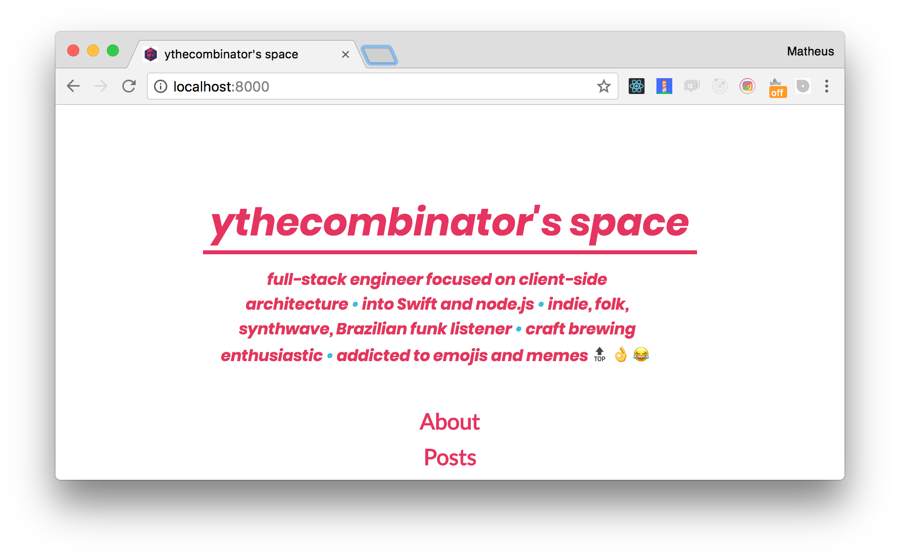

<h1 align="center">
	
	<br>
	<br>
</h1>

<br>
<br>

<p align="center">
	🎇 here's where you can find me on the web 🎇
<br>
<br>

<a href="https://codebeat.co/projects/github-com-ythecombinator-space-master">
	
</a>

<a href="https://codeclimate.com/github/ythecombinator/space/maintainability">
	
</a>

<a href="https://david-dm.org/ythecombinator/space" title="dependencies status">
	
</a>

<a href="https://david-dm.org/ythecombinator/space?type=dev" title="devDependencies status">
	
</a>

<a href="LICENSE.md">
    
</a>

</p>
<br>

## Getting Started

Clone the repository.

```sh
git clone git@github.com:ythecombinator/space.git
```

`cd` into the directory.

```sh
cd space
```

Install the project dependencies:

```sh
yarn

# or

npm install
```

Start the development server:

```sh
yarn dev

# or

npm run dev
```

🚀 Head over [localhost:8000](http://localhost:8000) in your browser of choice.

> Testing the Service Worker setup requires running as production:

```sh
yarn build

# or

npm run build
```

```sh
yarn start

# or

npm start
```

🚀 Head over [localhost:8001](http://localhost:8001) in your browser of choice.

## License

[ythecombinator.space](https://github.com/ythecombinator/space) is distributed under
the MIT License, [available in this repository](LICENSE.MD).

All contributions are assumed to
be also licensed under the same.

## Credits

Built on the top of the amazing [Superstylin' v2](https://github.com/bntzio/gatsby-starter-superstylin). A big thanks to [Enrique Benitez](https://github.com/bntzio)!
