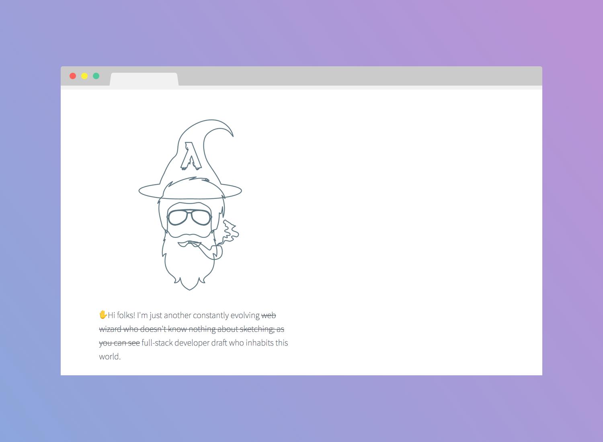

<h1 align="center">
	
	<br>
	<br>
</h1>

<br>
<br>

<p align="center">
	🎇 here's where you can find me on the web 🎇
</p>

<br>

---

## Table of Contents

<!-- DO NOT EDIT THE COMMENTS BELOW -->

<!-- toc -->

- [Features](#features)
- [Getting Started](#getting-started)
- [License](#license)
- [Credits](#credits)

<!-- tocstop -->

## Features

- Server-rendered [React](https://facebook.github.io/react/) with [Next.js](https://github.com/zeit/next.js/)

- Aliases React to [Preact](https://preactjs.com/) in production for a smaller bundle size

- Service worker support with [sw-precache](https://github.com/GoogleChrome/sw-precache)

- Component-friendly (server/client rendered) [PostCSS](http://postcss.org/) support for *JSX*

- Significant [Lighthouse](https://github.com/GoogleChrome/lighthouse) score–its evolution can be tracked [here](https://github.com/ythecombinator/me/issues/1).

## Getting Started

Clone the repository.

```sh
git clone git@github.com:ythecombinator/me.git
```

`cd` into the directory.

```sh
cd me
```

Install the project dependencies:

```sh
yarn

# or

npm install
```

Start the development server:

```sh
yarn dev

# or

npm run dev
```

Navigate to [localhost:3000](http://localhost:3000) in your browser of choice.

> Testing the Service Worker setup requires running as production:

```sh
yarn build

# or

npm run build
```

```sh
yarn start

# or

npm start
```

🚀 Navigate to [localhost:3000](http://localhost:3000) in your browser of choice.

## License

[ythecombinator.me](https://github.com/ythecombinator/me) is distributed under
the MIT License, available in this repository.

All contributions are assumed to
be also licensed under the same.

## Credits

Visual design inspiration was explicitly taken from [Rico's blog](https://github.com/rstacruz/rstacruz.github.io)–so special thanks to him 😁.
